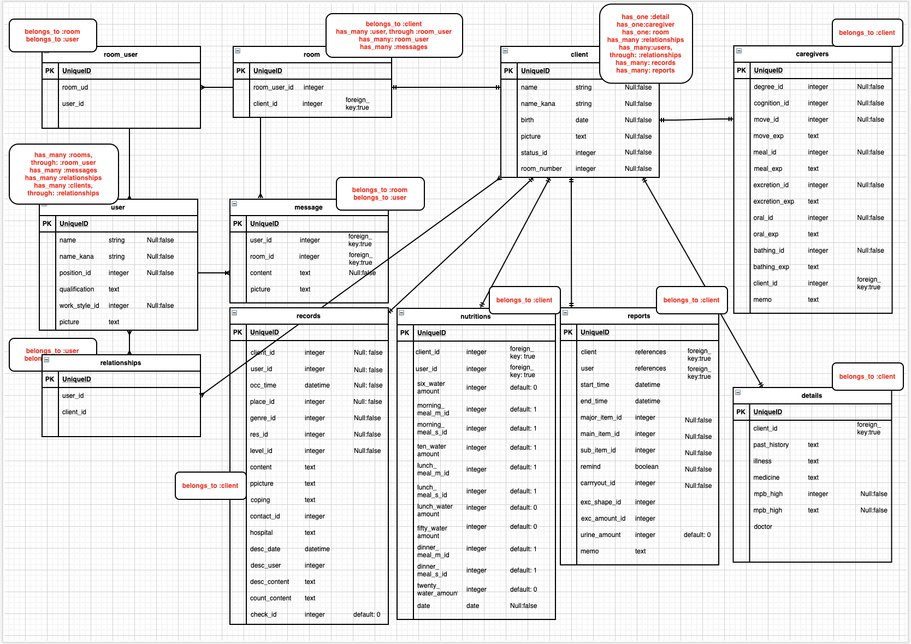

# Sup-App

## URL
【アプリケーションURL】
[Sup-App](https://www.sup-app.net/)(https://www.sup-app.net/)

## アプリの概要

介護施設で勤務する全ての介護士を、
「煩雑な記録」「紙の報告書」「長い申し送り」から解放します。

このアプリでは、

１．お客様の情報を管理・参照

２．スピーディーな記録

3．事故報告書の作成、ダウンロード

4．スタッフ同士の情報共有

が可能になります。

開発環境
* macbook pro (13-inch, 2020, Four Thunderbolt 3 ports)
* macOS Catalina (ver10.15.7)

## URL

## 操作画面GIF
①記録機能（記録の作成〜表示）

②記録機能（モーダル表示／実施切り替え）

③報告書作成機能（報告書の作成〜詳細の表示）

## 使用技術
* Ruby:2.6.5, Rails:6.0.0
* webpacker(css/js/jQuery)
* ngix,puma(sockets通信)
* Rspec

## 機能一覧
【①スタッフ（ユーザー）登録機能】
* ログイン機能（devise）
* 簡単ログイン・派遣ログイン機能
* スタッフ情報詳細表示、編集、削除機能

【②お客様情報管理機能】
* お客様情報登録機能（sessionウィザード形式）
* お客様情報詳細表示、編集、削除機能

【③チャットルーム機能】
* 非同期チャット機能（json,ActionCable）
* 自動スクロール（jQuery）
* メッセージのタグ付け機能
* 画像投稿、テキスト投稿機能

【④記録機能】
* 介護記録の個別作成、編集、削除、一覧表示機能
* シングルクリックでモーダル表示（jQuery）
* ダブルクリックで介助の実施／非実施切り替え（Javascript）
* 項目別記録（水分量・食事量）機能

【⑤報告書作成機能】
* 報告書作成、詳細表示、編集、削除機能
* 10件ごとの一覧表示（Kaminari）
* 報告書（一覧、個別）データのCSV形式出力機能

【その他】
* rails構文規約チェックツール（Rubocop）
* テストデータ投入（Faker）
* テストの実施(RSpec)
* ドメインの取得（Route53）

## 工夫点
* ユーザビリティ向上のため、現役介護士に定期的なフィードバックを受けてアプリを改善した。
* 記録に時間がかかりがちな食事・水分量を別ページから手早く記録できるよう実装した。
* 報告書の出力を簡便にするため、CSV形式の出力機能を実装した。

## インフラ構成図

## 今後の改善・修正予定
* 通知機能、既読機能を実装し、機能の充実を図る。
* テストコードの記述、バリデーションの見直しを通して、アプリケーションの安全性を確保する。

## 作成の背景
新卒入社した介護施設で感じた「不便」が、このアプリを作成したきっかけです。

* お客様の介助内容を口頭で伝え、紙に記入し、それをPCに打ち込む…。

* 紙媒体の報告書を施設内で持ち歩く。もし紛失したら…。

* リーダーが1時間おき（スタッフが出社するたび）に繰り返さなければならない、長すぎる「申し送り」。

**その時間を、少しでも「お客様」のために使いたい。**

記録業務や報告書作成業務、申し送りの時間を短縮することで、介護士が本来担うべき「お客様のケア」を全うできるように、このアプリケーションを作成しました。

**【これまでの記録】**

1.お客様の介助を行う

2.記録をメモする

3.リーダー、あるいは記録の担当者に報告する

4.担当者は紙媒体に記録を記入する

５.まとめてPCに記録を行う

**【このアプリを使えば】**

1.お客様の介助を行う

2.スマートフォンで記録を行う

（これだけでOK！さらに「リマインド」を使えば、記録もダブルタップで完了します。）

介護士を楽に、そして、お客様に笑顔を。

このアプリケーションは現役介護士のフィードバックを受けながら、介護士のために進化を続けます。

### 以下全てテーブル設計

### ER図

### client テーブル

| Column         | Type    | Options     |
| -------------- | ------- | ----------- |
| name           | string  | null: false |
| name_kana      | string  | null: false |
| birth          | date    | null: false |
| room_number    | integer | null: false |
| picture        | text    |             |
| status_id      | integer | null: false |
| careplan       | text    |             |
| sex_id         | integer | null: false |
| insurance      | integer |             |

#### Association

- has_one :detail
- has_one :care
- has_one :room
- has_many :relationships
- has_many :users, through: :relationships
- has_many :records
- has_many :reports

###  detail テーブル

| Column         | Type    | Options                        |
| -------------- | ------- | ------------------------------ |
| client_id      | integer | null: false, foreign_key: true |
| past_history   | text    |                                |
| illness        | text    |                                |
| medicine       | text    |                                |
| doctor         | text    |                                |
| mbp_high       | integer | null: false                    |
| mbp_low        | integer | null: false                    |

#### Association

- belongs_to :client

###  caregiver テーブル

| Column         | Type    | Options                        |
| -------------- | ------- | ------------------------------ |
| client_id      | integer | null: false, foreign_key: true |
| degree_id      | integer | null: false                    |
| cognition_id   | integer | null: false                    |
| move_id        | integer | null: false                    |
| move_exp       | text    |                                |
| meal_id        | integer | null: false                    |
| meal_exp       | text    |                                |
| excretion_id   | integer | null: false                    |
| excretion_exp  | text    |                                |
| oral_id        | integer | null: false                    |
| oral_exp       | text    |                                |
| bathing_id     | integer | null: false                    |
| bathing_exp    | text    |                                |
| memo           | text    |                                |

#### Association

- belongs_to :client

### user テーブル

| Column           | Type    | Options     |
| ---------------- | ------- | ----------- |
| name             | string  | null: false |
| name_kana        | string  | null: false |
| password         | string  | null: false |
| staff_number     | integer | null: false |
| position_id      | integer | null: false |
| qualification_id | integer | null: false |
| work_style_id    | integer | null: false |
| picture          | text    |             |

#### Association
- has_many :rooms, through: room_user
- has_many :room_users
- has_many :messages
- has_many :relationships
- has_many :clients, through: :relationships

### rooms テーブル

| Column    | Type       | Options                        |
| --------- | ---------- | ------------------------------ |
| client_id | integer    | null: false, foreign_key: true |

#### Association
- belongs_to :client
- has_many :user, through: room_staff
- has_many :room_user
- has_many :messages

### room_user テーブル

| Column    | Type       | Options                        |
| --------- | ---------- | ------------------------------ |
| room_id   | integer    | null: false, foreign_key: true |
| user_id   | integer    | null: false  foreign_key: true |

#### Association
- belongs_to :room
- belongs_to :user

### messages テーブル

| Column    | Type       | Options                        |
| --------- | ---------- | ------------------------------ |
| user_id   | integer    | null: false, foreign_key: true |
| room_id   | integer    | null: false  foreign_key: true |
| content   | text       | null: false                    |
| picture   | text       |                                |
| tag_id    | integer    |                                |

#### Association
- belongs_to :room
- belongs_to :user

### relationships テーブル

| Column    | Type        | Options                        |
| --------- | ----------- | ------------------------------ |
| user      | references  | null: false, foreign_key: true |
| client    | references  | null: false  foreign_key: true |

#### Association
- belongs_to :user
- belongs_to :client

### records テーブル

| Column         | Type       | Options                        |
| -------------- | ---------- | -------------------------------|
| client         | references | null: false, foreign_key: true |
| user           | references | null: false, foreign_key: true |
| start_time     | datetime   | null: false                    |
| end_time       | datetime   | null: false                    |
| major_item_id  | integer    | null: false                    |
| main_item_id   | integer    | null: false                    |
| sub_item_id    | integer    | null: false                    |
| remind         | boolean    |                                |
| carryout_id    | integer    | null: false                    |
| meal_m_id      | integer    |                                |
| meal_s_id      | integer    |                                |
| water_amount   | integer    | default: 0                     |
| exc_shape_id   | integer    |                                |
| exc_amount_id  | integer    |                                |
| urine_amount   | integer    | default: 0                     |
| memo           | text       |                                |

#### Association
- belongs_to :client

### nutritions テーブル

| Column              | Type       | Options                        |
| ------------------- | ---------- | -------------------------------|
| client              | references | null: false, foreign_key: true |
| user                | references | null: false, foreign_key: true |
| date                | date       | null: false                    |
| six_water_amount    | integer    | null: false, default: 0        |
| morning_meal_m_id   | integer    | null: false, default: 1        |
| morning_meal_s_id   | integer    | null: false, default: 1        |
| ten_water_amount    | integer    | null: false, default: 0        |
| lunch_meal_m_id     | integer    | null: false, default: 1        |
| lunch_meal_s_id     | integer    | null: false, default: 1        |
| lunch_water_amount  | integer    | null: false, default: 0        |
| fifty_water_amount  | integer    | null: false, default: 0        | | dinner_meal_m_id    | integer    | null: false, default: 1        |
| dinner_meal_s_id    | integer    | null: false, default: 1        |
| dinner_water_amount | integer    | null: false, default: 0        |
| twenty_water_amount | integer    | null: false, default: 0        |

### Association
- belongs_to :client

### reports テーブル

| Column         | Type       | Options                        |
| -------------- | ---------- | -------------------------------|
| client_id      | integer    | null: false                    |
| user_id        | integer    | null: false                    |
| occ_time       | datetime   | null: false                    |
| place_id       | integer    | null: false                    |
| genre_id       | integer    | null: false                    |
| res_id         | integer    | null: false                    |
| level_id       | integer    | null: false                    |
| content        | text       |                                |
| picture        | text       |                                |
| coping         | text       |                                |
| contact_id     | integer    |                                |
| hospital       | text       |                                |
| desc_date      | datetime   |                                |
| desc_user      | integer    |                                |
| desc_content   | text       |                                |
| count_content  | text       |                                |
| check_id       | integer    | null: false, default: 0        |

#### Association
- belongs_to :client
