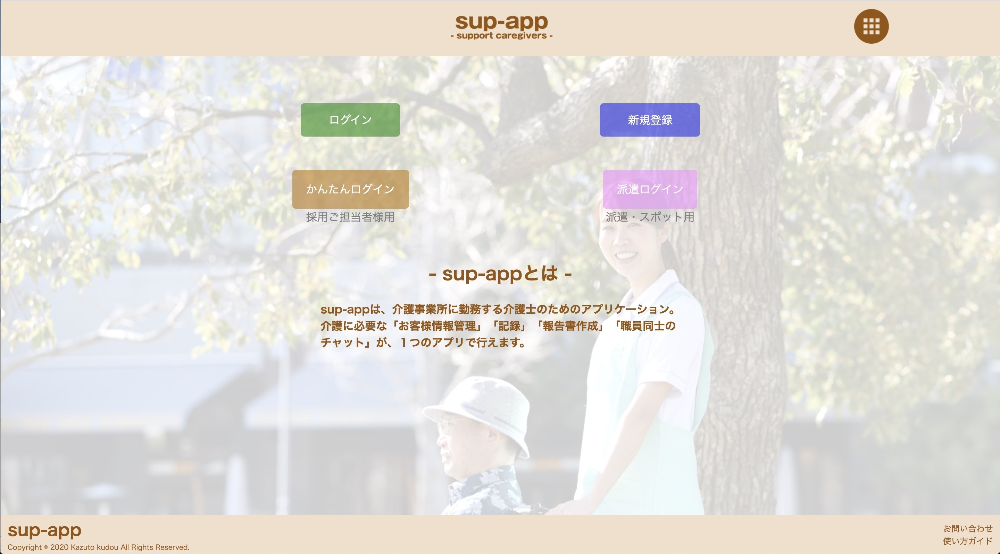
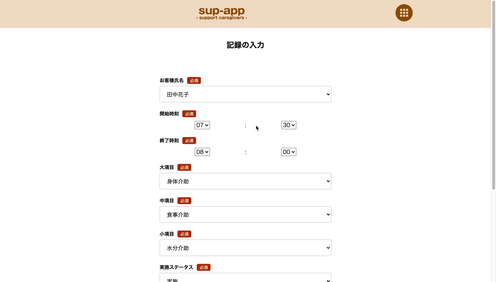
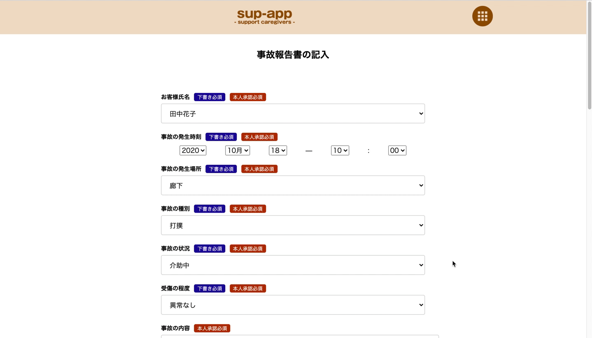
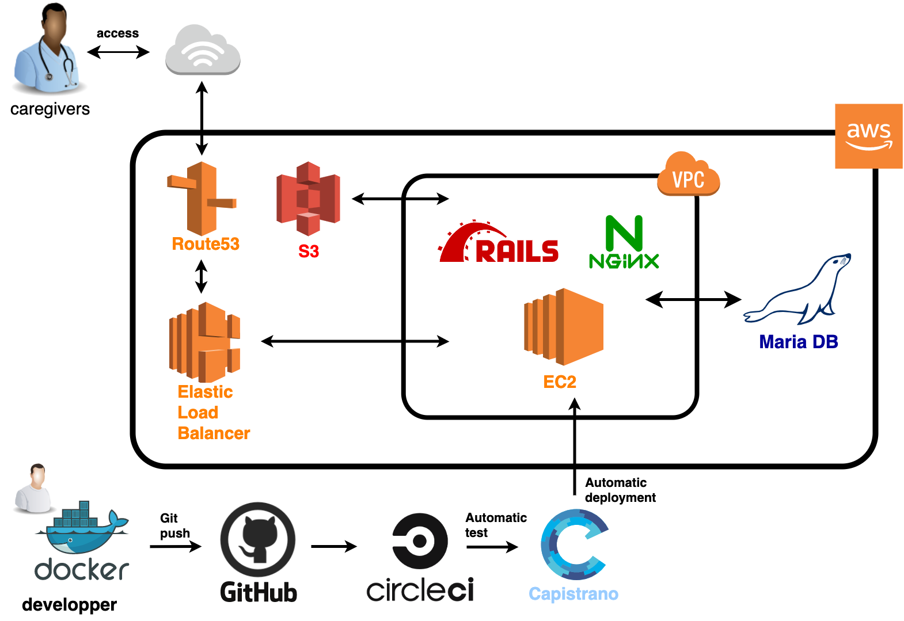
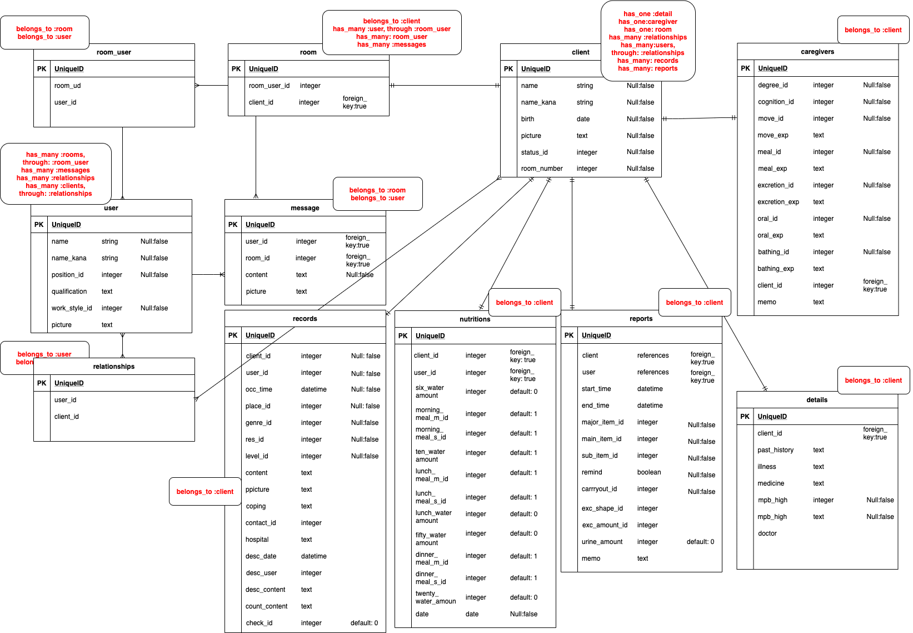

# Sup-App

## URL
【アプリケーションURL】
[Sup-App](https://www.sup-app.net/)(https://www.sup-app.net/)

## アプリの概要

介護施設で勤務する全ての介護士を、
「煩雑な記録」「紙の報告書」「長い申し送り」から解放します。

このアプリでは、

１．お客様の情報を管理・参照

２．スピーディーな記録

3．事故報告書の作成、ダウンロード

4．スタッフ同士の情報共有

が可能になります。

開発環境
* macbook pro (13-inch, 2020, Four Thunderbolt 3 ports)
* macOS Catalina (ver10.15.7)

## URL

## 操作画面GIF
**①記録機能（記録の作成〜表示）**
* フォームに入力し、保存した記録を時系列の表形式で表示します。
* 記録の種類が一眼でわかるアイコンを採用しています。

**②記録機能（モーダル表示／実施切り替え）**
* アイコンをシングルクリックするとモーダルを表示します。
* モーダルには記録の詳細が表示され、編集・削除にリンクできます。
* アイコンをダブルクリックすると記録の実施／非実施を素早く切り替えます。
* 実施済みのものはアイコンが灰色に変化し、実施／非実施が一眼でわかります。

**③報告書作成機能（報告書の作成〜詳細の表示）**
* フォームに入力し、保存した報告を事故報告書の形式で表示します。
* 保存した報告書はCSV形式で出力できます。
* 出力は、個別の出力と1ヶ月分の出力を行うことができます。

## 使用技術
* Ruby:2.6.5, Rails:6.0.0
* webpacker(css/Javascrict)
* nginx,puma(sockets通信)
* Docker(ローカル環境)
* CircleCI(自動テスト)
* CircleCD(自動デプロイ)
* Rspec

## 機能一覧
【①スタッフ（ユーザー）登録機能】
* ログイン機能（devise）
* 簡単ログイン・派遣ログイン機能
* スタッフ情報詳細表示、編集、削除機能

【②お客様情報管理機能】
* お客様情報登録機能（sessionウィザード形式）
* お客様情報詳細表示、編集、削除機能

【③チャットルーム機能】
* 非同期チャット機能（json,ActionCable）
* 自動スクロール
* メッセージのタグ付け機能
* 画像投稿、テキスト投稿機能

【④記録機能】
* 介護記録の個別作成、編集、削除、一覧表示機能
* シングルクリックでモーダル表示
* ダブルクリックで介助の実施／非実施切り替え（Javascript）
* 項目別記録（水分量・食事量）機能

【⑤報告書作成機能】
* 報告書作成、詳細表示、編集、削除機能
* 10件ごとの一覧表示（Kaminari）
* 報告書（一覧、個別）データのCSV形式出力機能

【その他】
* rails構文規約チェックツール（Rubocop）
* テストデータ投入（Faker）
* テストの実施(RSpec)
* ドメインの取得（Route53）

## 工夫点
* ユーザビリティ向上のため、現役介護士に定期的なフィードバックを受けてアプリを改善した。
* 記録に時間がかかりがちな食事・水分量を別ページから手早く記録できるよう実装した。
* 報告書の出力を簡便にするため、CSV形式の出力機能を実装した。

## インフラ構成図

## 今後の改善・修正予定
* 通知機能、既読機能を実装し、機能の充実を図る。
* テストコードの記述、バリデーションの見直しを通して、アプリケーションの安全性を確保する。
* インシデント報告書を作成できる機能を実装する。

## 作成の背景
新卒入社した介護施設で感じた「不便」が、このアプリを作成したきっかけです。

* お客様の介助内容を口頭で伝え、紙に記入し、それをPCに打ち込む…。

* 紙媒体の報告書を施設内で持ち歩く。もし紛失したら…。

* リーダーが1時間おき（スタッフが出社するたび）に繰り返さなければならない、長すぎる「申し送り」。

**その時間を、少しでも「お客様」のために使いたい。**

記録業務や報告書作成業務、申し送りの時間を短縮することで、介護士が本来担うべき「お客様のケア」を全うできるように、このアプリケーションを作成しました。

**【これまでの記録】**

1.お客様の介助を行う

2.記録をメモする

3.リーダー、あるいは記録の担当者に報告する

4.担当者は紙媒体に記録を記入する

５.まとめてPCに記録を行う

**【このアプリを使えば】**

1.お客様の介助を行う

2.スマートフォンで記録を行う

（これだけでOK！さらに「リマインド」を使えば、記録もダブルタップで完了します。）

介護士を楽に、そして、お客様に笑顔を。

このアプリケーションは現役介護士のフィードバックを受けながら、介護士のために進化を続けます。

## ER図

